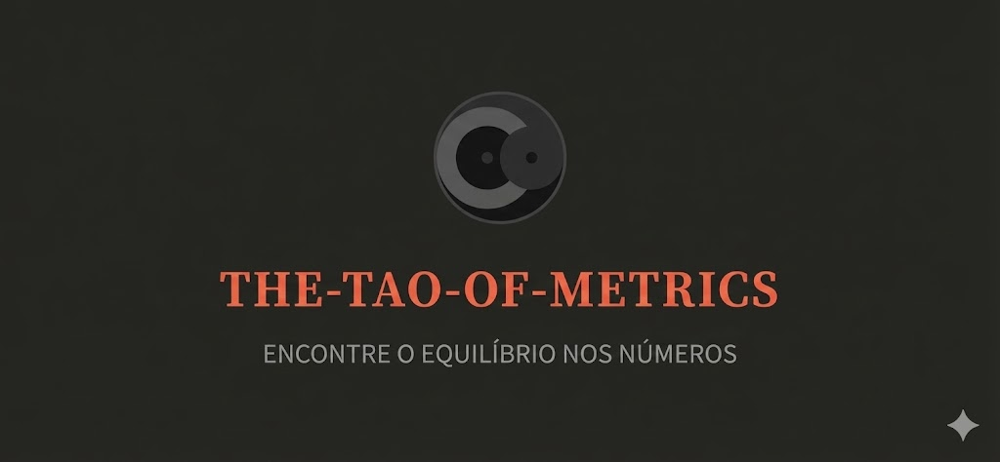
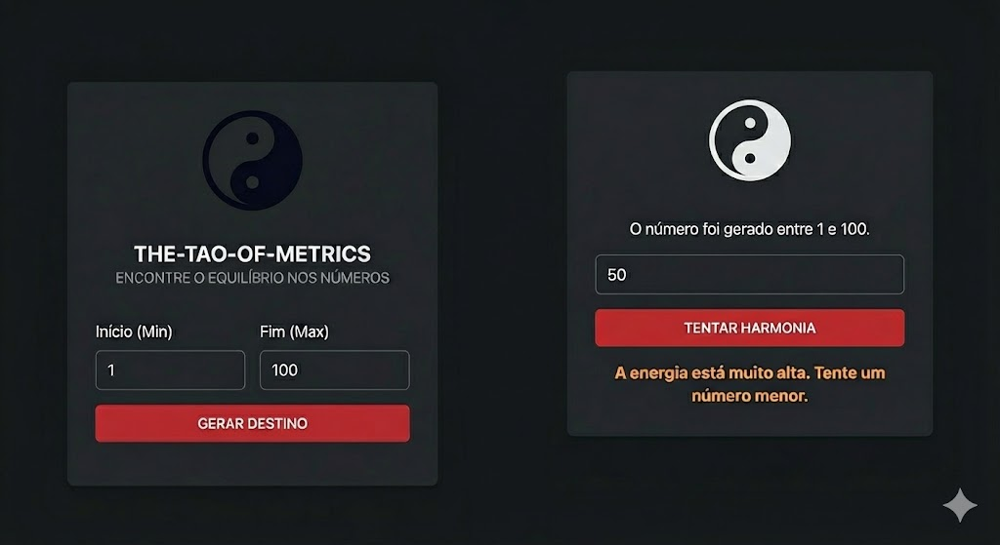
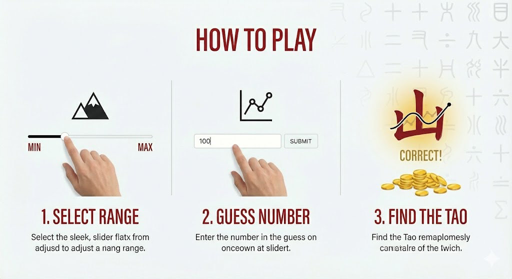

# ☯ The Tao of Metrics



> *"The number that can be guessed is not the true number. But we can attempt to find harmony."*

**The Tao of Metrics** is a minimalist mathematical guessing game inspired by Chinese philosophy and aesthetics. The goal is simple: find the hidden number generated by "destiny" within a range chosen by the user.

## 🏮 Overview

This project was developed with a focus on **Modernity**, **Minimalism**, and **Usability**. There are no heavy frameworks or external libraries; just the purity of native code delivering a fluid and aesthetically pleasing experience.



## ✨ Features

* **Minimalist Design:** A clean interface inspired by rice paper and Sumi-e ink.
* **Pure CSS Animations:** The Yin-Yang symbol and visual effects are rendered mathematically via CSS, with no need for heavy image files.
* **Thematic Feedback:** The system guides the user by sensing if the guess energy is "too high" or "too low."
* **Responsive:** Adapts perfectly to both desktop screens and mobile devices.
* **Lightweight & Fast:** Instant loading due to zero external dependencies.

## 📜 How to Play



1.  **Define the Path:** Choose a numeric range (Minimum and Maximum) using the setup panel.
2.  **Generate Destiny:** The system will choose a random number within this flow.
3.  **Find Harmony:** Enter your guesses. The system will tell you if you need to raise or lower your vibration (number).
4.  **Victory:** When the number is found, balance is restored.

## 🛠️ Technologies Used

* **Semantic HTML5:** Clear and accessible structure.
* **Modern CSS3:** Usage of variables (`:root`), Flexbox, Gradients, and Keyframe Animations.
* **JavaScript (ES6+):** Clean game logic, DOM manipulation, and input validation.

## 🚀 How to Run

No installation is required. Follow the steps below to run it locally:

1.  Clone this repository:
    ```bash
    git clone [https://github.com/your-username/the-tao-of-metrics.git](https://github.com/your-username/the-tao-of-metrics.git)
    ```
2.  Navigate to the project folder.
3.  Open the `index.html` file in your preferred browser.

## 📂 File Structure